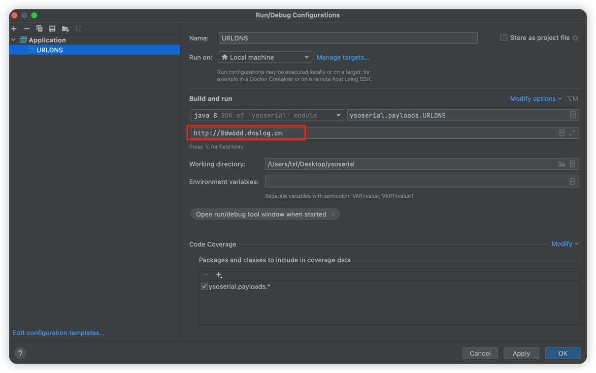
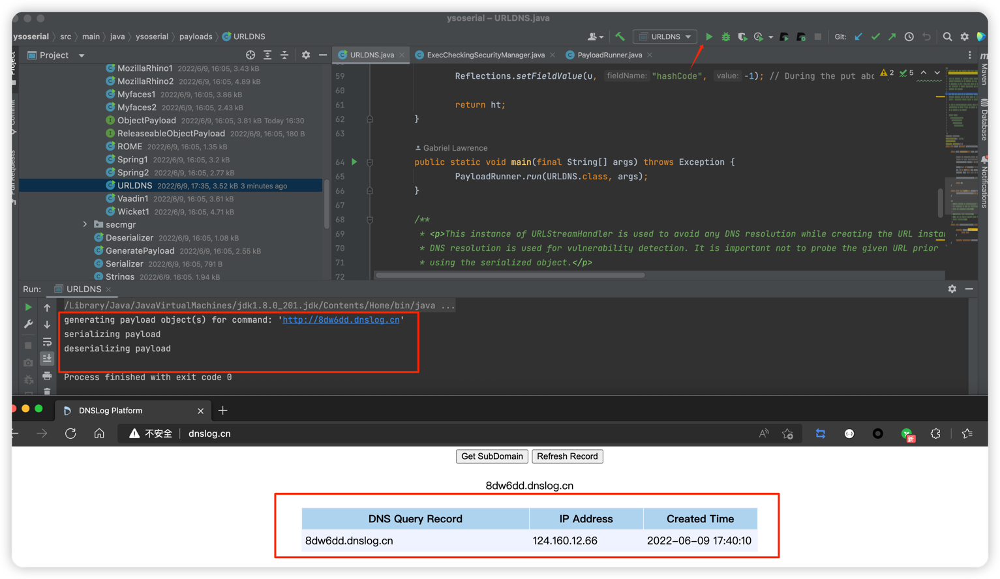

## 初见Ysoserial

> https://github.com/frohoff/ysoserial

> 利⽤链
利⽤链也叫“gadget chains”，我们通常称为gadget。

### 编译jar包
```
git clone https://github.com/frohoff/ysoserial.git
cd ysoserial
mvn clean package -DskipTests
```

### URLDNS入门

在检测反序列化漏洞时

不依赖第三⽅库
通过DNS请求得知是否存在反序列化漏洞
##### 生成dnslog地址
http://dnslog.cn =》 Get SubDomain =》 8dw6dd.dnslog.cn

##### 增加启动args
· 记得在url前增加http协议



##### 执行
